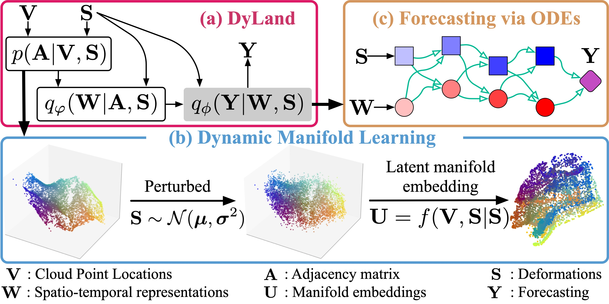

# Learning Spatio-Temporal Manifold Representation for Probabilistic Land Deformation Prediction


This repo provides an implementation of **DyLand** framework 
for land deformation forecasting described in the following paper:

> Learning Spatio-Temporal Manifold Representation for Probabilistic Land Deformation Prediction  
> Under review, 2022

<p align="center">

</p>

## Install dependencies

In this repo, DyLand is implemented by `pytorch=1.11.0`, `python=3.10.4`, `cudatoolkit=11.3`.

```shell
conda create --name=dyland

conda activate dyland

conda install pytorch torchvision torchaudio cudatoolkit=11.3 -c pytorch
```

## Run

```shell
python main.py  --data pbg_east
```

More options can be found in `args.py`. 


## Data

We provide four sampled datasets used in the paper in `data` folder. 

- `hzy_west.csv`
- `hzy_east.csv`
- `pbg_east.csv`
- `pbg_west.csv`

